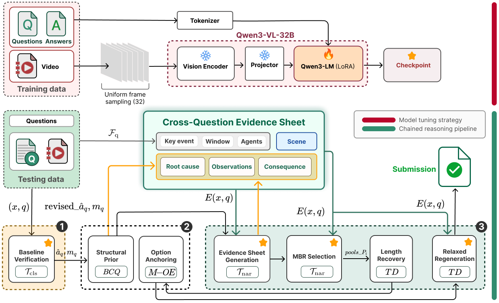

<div align="center">

# AI City Challenge 2026 — Track 3: Traffic Anomaly Reasoning

## Evidence-Driven Chained Reasoning for Unified Traffic Anomaly Understanding

[](https://huggingface.co/Qwen/Qwen3-VL-32B-Instruct)
[](https://github.com/modelscope/ms-swift)
[](https://developer.nvidia.com/cuda-toolkit-archive)

</div>
A system that separates what the model learns to produce from how its final answer is chosen. A single Vision-Language backbone is tuned once to give a fixed, task-appropriate answer for every question type. A deterministic and fully inspectable procedure then converts, verifies and selects among the backbone's own outputs, without prompting it in any form it was not trained on.

---



## 1. Setup

### a. Environment
> **Anaconda**, per [requirements.txt](requirements.txt) (CUDA 12.8 /
vLLM 0.11 / ms-swift / transformers 4.57):

```bash
conda create -n vlm python=3.12 -y && conda activate vlm
pip install vllm==0.11.0 --extra-index-url https://download.pytorch.org/whl/cu128
pip install ms-swift -U
pip install transformers==4.57.0
conda install -c nvidia cuda-nvcc=12.8.93 -y
pip install flash-attn --no-build-isolation
pip install qwen-vl-utils==0.0.14 deepspeed decord wandb bert-score
```

### b. Data
`bash scripts/download_data.sh` (annotations + test clips), then place the
8 upstream train-video sources under `train/videos/` (see the HF README). Expected
layout under `$TAR_ROOT`:

```
$TAR_ROOT/
├── train/   # ANN_DIR
│   ├── bcq.json  mcq.json  bcq_openended.json  mcq_openended.json  open_qa.json
│   ├── causal_linkage.json  scene_description.json  temporal_description.json
│   ├── temporal_localization.json  video_summarization.json
│   └──  videos/<sub-dataset>    # TRAIN_VIDEOS_ROOT
│   
└── test/
    ├── test.json
    ├── clip_manifest.csv
    ├── download_test_videos.py
    ├── evaluate.py
    └── videos/<video_id>        # TEST_VIDEOS_ROOT
```

Train = 3,669 videos × 10 tasks → 44,040 items (auto-labelled). Test = 960 items / 80
clips (human-curated). Pipeline outputs live outside `$TAR_ROOT` in `data/processed/`,
`output/`, `preds/`, `submissions/`.

### c. Values to edit
All machine-specific values live in **[init.sh](init.sh)**;
edit it once, then `source init.sh` before every run. It overrides the defaults in
`configs/common.sh` + `configs/qwen3vl_32b_lora.sh` (which stay untouched):

| Value | What |
|---|---|
| `TAR_ROOT` | dataset root (layout above) |
| `MODEL` | Qwen3-VL-32B-Instruct dir or HF id |
| `CUDA_VISIBLE_DEVICES` | GPUs (default profile assumes 4× A100-80G) |
| `HF_TOKEN`, `WANDB_API_KEY` | optional secrets (empty ⇒ skipped; wandb off with `REPORT_TO=tensorboard`) |

Activate the conda env yourself (`conda activate vlm`) before `source init.sh` — the
scripts run in whatever env is active.

Defaults are already `MODEL_CONFIG=qwen3vl_32b_lora` and `PROFILE=a100_80g_4x_32b`
(4× A100-80G, DeepSpeed ZeRO-3); the LoRA/optim recipe (r16/α32 `all-linear`, ViT +
aligner frozen, 2 epochs, lr 2e-4, bf16, 32 frames) is baked in — do not change it to
reproduce.

---

## 2. Run

### Step-0: Init
Complete all information for Model path, Data root path, etc., in **[init.sh](init.sh)**
```bash
# 1. Dataset root (expected layout in README §1b).
export TAR_ROOT="/abs/path/to/AI-City26-TAR/data"
# 2. Base model: a local Qwen3-VL-32B-Instruct dir, or the HF id.
export MODEL="Qwen/Qwen3-VL-32B-Instruct"
```

### Step-1: Prepare Enviroments and Training data

```bash
conda activate vlm 
source init.sh
```

### Step-2: Train. base multi-task LoRA SFT
```bash
# Train — base multi-task LoRA SFT (scripts/prove/phase0_base_sft.sh).
bash scripts/prove/phase0_base_sft.sh
```
Step-2 already merges its last checkpoint. To merge a **different** checkpoint by hand
(the exact `swift export` it runs internally) and get a `MODEL_PATH`:

```bash
swift export --adapters output/<run>/checkpoint-XXXX --merge_lora true 
```

### Step-3: Inference

> For reproduction, can be found our tuning Qwen3-VL-32B (merged) form Hugging Face here: [Checkpoint_Qwen3-VL-32B_Team12](https://huggingface.co/YudGNourt/Qwen3-VL-32B-TAR) 

```bash
# (2) Infer — full inference chain -> FINAL submission (scripts/prove/phase3_infer.sh).
#     MODEL_PATH is required: point it at the merged dir from step (1).
PYTORCH_CUDA_ALLOC_CONF="expandable_segments:True" GPU_MEM_UTIL=0.85 NUM_FRAMES=32 \
MODEL_PATH="$(cat output/prove/BASE_MODEL_PATH)" \
    bash scripts/prove/phase3_infer.sh
```


## License

Released for reproducibility under the AI City Challenge 2026 award requirements (set an
OSS license in `LICENSE` before public release). The official scorer `evaluate.py` and
the TAR dataset / its upstream sources retain their original terms; test clips are cut
from public YouTube videos under the dataset's research terms.
